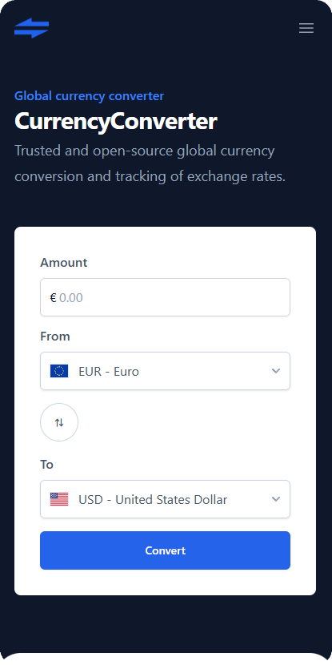

# 💱 CurrencyConverter

[CurrencyConverter](https://currencyconverter-frontend.vercel.app/) is a lightning-fast web application offering instant currency conversions with hourly updated rates. Enjoy a responsive design for seamless use on any device, and an intuitive interface for easy navigation.

 

## Getting Started

### Prerequisites

Make sure you have the following installed:

- [Bun](https://bun.sh/)
- [Angular CLI](https://angular.dev/installation#install-angular-cli)

### Installation

1. Clone the repository:

   ```bash
   git clone https://github.com/gabrielpalassi/CurrencyConverter.git
   ```

2. Install dependencies:

   ```bash
   cd CurrencyConverter
   bun run post-clone
   ```

### Running localy

In the root directory run:

```bash
bun run start
```

This will start both front and back-end projects.

Your browser should automatically open at `http://localhost:4200`, where the app will be accessible.

## Code Quality

To ensure code quality and consistency, the following tools are required and should be run from the root of the repository:

- **Formatting**: Use Prettier to automatically format your code according to the project's style guidelines.

  ```bash
  bun run format
  ```

- **Linting**: Employ ESLint to identify and address code quality issues.

  ```bash
  bun run lint
  ```

- **Format and Lint**: Run both formatting and linting in one step to ensure your code meets all quality standards.

  ```bash
  bun run format-and-lint
  ```

- **Pre-commit**: This script runs before each commit to enforce code quality. It performs formatting checks with Prettier and linting checks with ESLint, in that order. The commit will only proceed if all checks pass.

  ```bash
  bun run pre-commit
  ```

## Contributing

We welcome contributions from the community! To get started, please follow these guidelines:

### Commit Message Guidelines

We use [Husky](https://typicode.github.io/husky/#/) to enforce commit message conventions. Please ensure your commit messages adhere to the following format:

```
<type>(<scope>): <subject>
```

#### Types

- **feat**: A new feature
- **fix**: A bug fix
- **docs**: Documentation only changes
- **style**: Changes that do not affect the meaning of the code (white-space, formatting, missing semi-colons, etc)
- **refactor**: A code change that neither fixes a bug nor adds a feature
- **perf**: A code change that improves performance
- **test**: Adding missing tests or correcting existing tests
- **chore**: Changes to the build process or auxiliary tools and libraries such as documentation generation

#### Scope

The scope should be the name of the module affected (as perceived by the person reading the changelog generated from commit messages). It could also be something like the feature worked on, etc.

#### Subject

The subject contains a succinct description of the change:

- Use the imperative, present tense: "change" not "changed" nor "changes"
- Do not capitalize the first letter
- Do not end the subject with a period

### Pull Request Process

1. Fork the repository.
2. Create your feature branch (`git checkout -b feature/your-feature`).
3. Commit your changes (`git commit -m 'feat(scope): add new feature'`).
4. Push to the branch (`git push origin feature/your-feature`).
5. Open a pull request.

### Code Reviews

All submissions, including submissions by project members, require review. We use GitHub pull requests for this purpose. Consult [GitHub Help](https://help.github.com/articles/about-pull-requests/) for more information on using pull requests.

Thank you for your contributions!

## License

This project is licensed under the GPL-3.0 License. See the [LICENSE](LICENSE) file for more information.

Happy converting!
